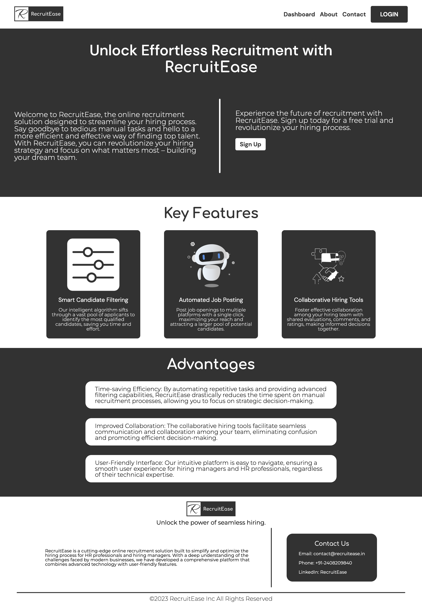
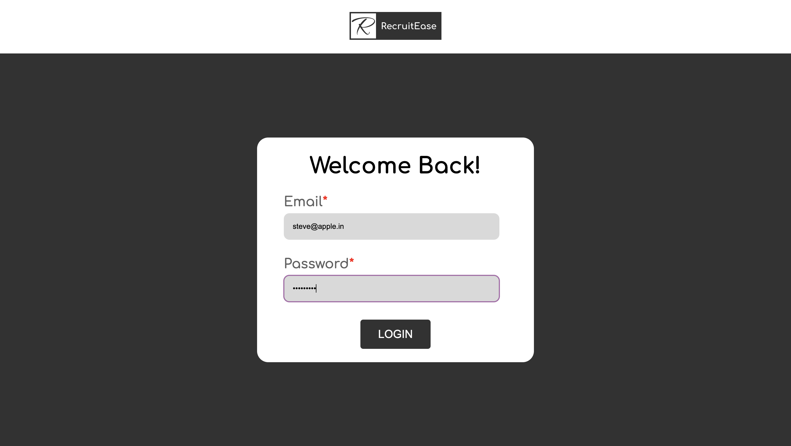
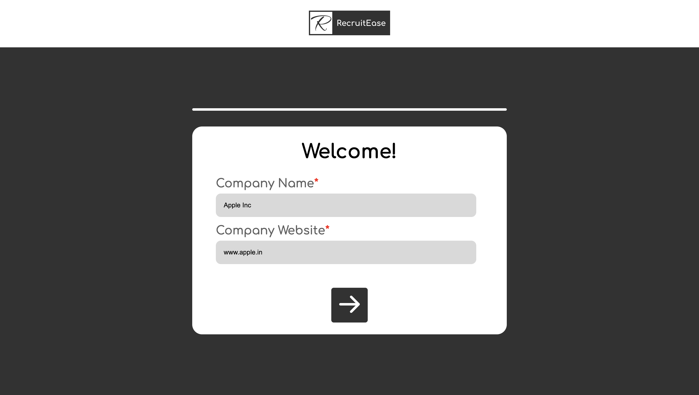
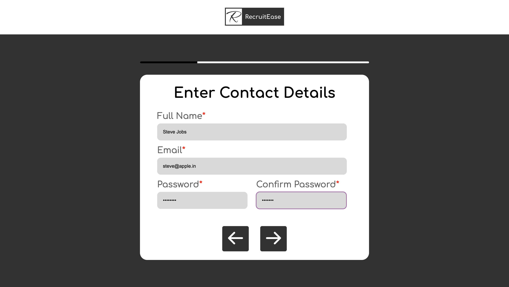
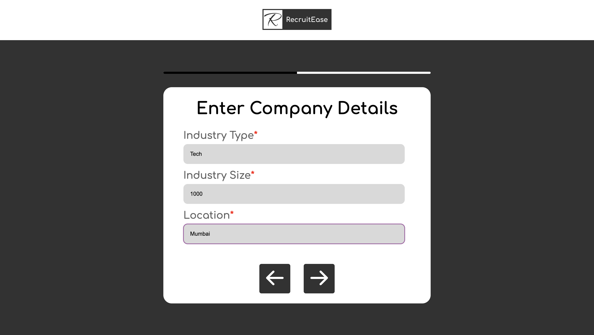
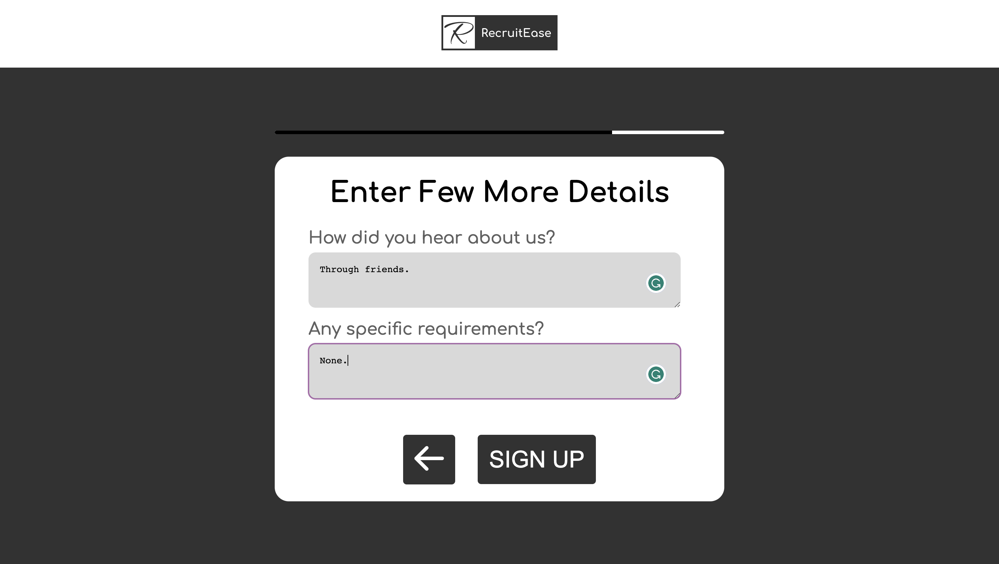

 

<h1  align="center">RecruitEase</h1>

<!-- TABLE OF CONTENTS -->

  
<h2 style="display: inline-block">Table of Contents</h2>

  <ol>
    <li>
      <a href="#about-the-project">About The Project</a>
    </li>
    <li>
      <a href="#figma-design">Figma Design</a>
    </li>
    <li>
      <a href="#built-with">Built With</a>
    </li>
    <li>
      <a href="#screenshots">Screenshots</a>
    </li>
    <li>
      <a href="#contributing">Contributing</a>
    </li>
    <li>
      <a href="#license">License</a>
    </li>
  </ol>

## About The Project

 
RecruitEase is a frontend task by Study Monk to design and develop a digital recruitment solution app aimed at providing a seamless hiring experience for multiple MNCs.
The three pages are:
 
<ol>
    <li>
        Homepage: Create an engaging landing page that showcases the key features and benefits of the online recruitment solution, emphasizing its efficiency for hiring managers and HR professionals.
    </li>
    <li>
        User Login and Register Pages: Develop secure login and registration pages specifically tailored for companies. This will enable them to access the recruitment solution and utilize its features effectively.
    </li>
    <li>
        Candidate Search: Implement a search functionality that allows users to find candidates based on location and job roles. Additionally, design a section where the fetched candidates can be listed for later ranking and evaluation.
    </li>
</ol>
 

## Figma Design

The Link to preview the figma design is <a href="https://www.figma.com/proto/tuZrqzGFNURRM6QVIZgwGs/RecruitEase(Study-Monk)?page-id=0%3A1&type=design&node-id=3-21&viewport=340%2C-82%2C0.83&t=RRYb4wdCUrwf8CBN-1&scaling=min-zoom&starting-point-node-id=3%3A21&mode=design">here.</a>

### Built With

* [HTML](https://www.w3schools.com/html/)
* [CSS3](https://www.w3schools.com/css/)
* [JS](https://www.javascript.com/)
* [MongoDB](https://www.mongodb.com/)
* [Express](https://expressjs.com/)
* [LottieFiles](https://lottiefiles.com/)

## Screenshots

### Login
 

### SignUp(1/4).
 
### SignUp(2/4).
 
### SignUp(3/4).
 
### SignUp(4/4).
 
### Dashboard
 

## Contributing

Contributions are what make the open source community such an amazing place to be learn, inspire, and create. Any contributions you make are **greatly appreciated**.

1. Fork the Project
2. Create your Feature Branch (`git checkout -b feature/AmazingFeature`)
3. Commit your Changes (`git commit -m 'Add some AmazingFeature'`)
4. Push to the Branch (`git push origin feature/AmazingFeature`)
5. Open a Pull Request

## License

Distributed under the MIT License. See `LICENSE` for more information.